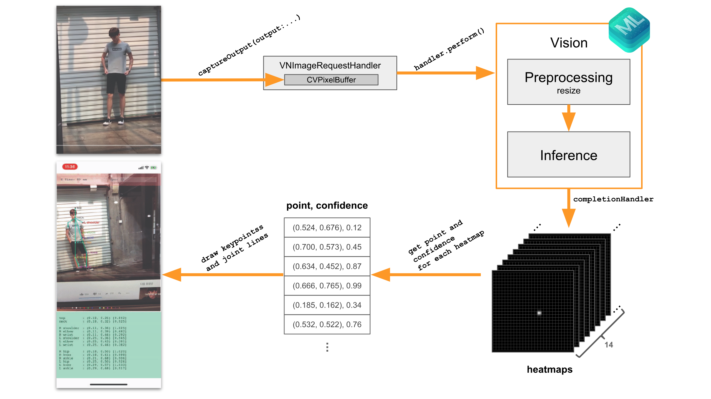
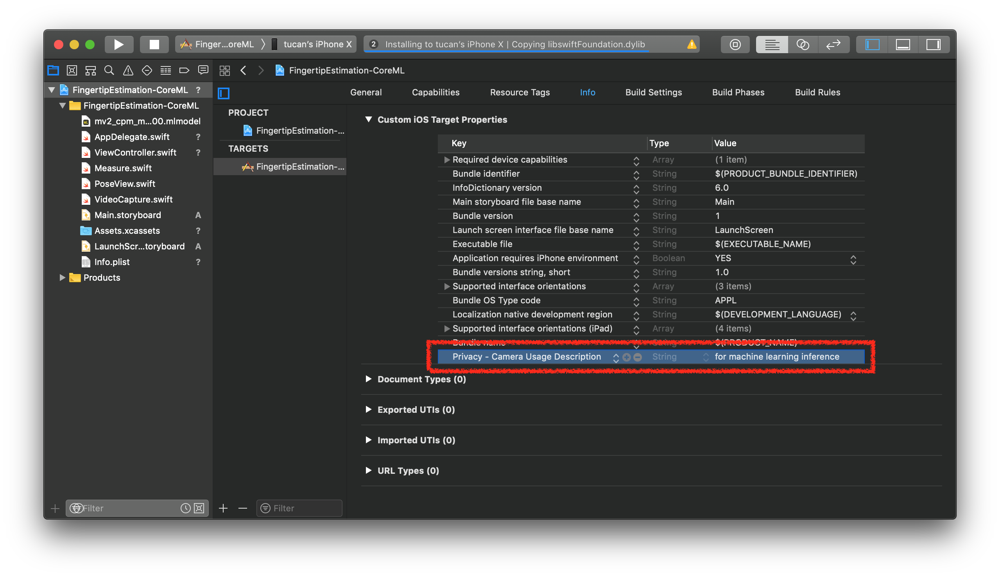
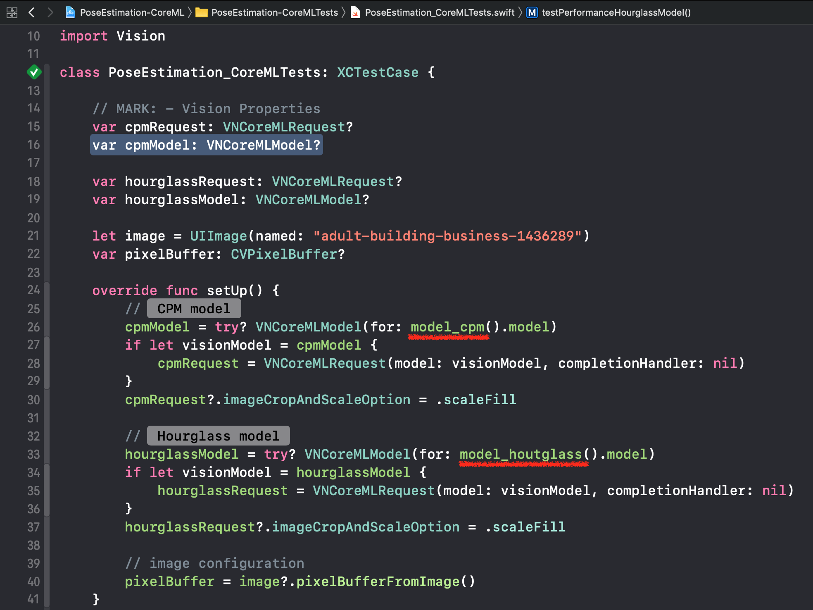
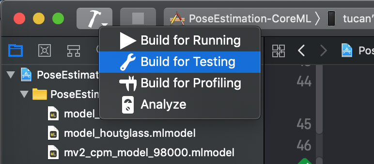

# PoseEstimation-CoreML


This project is Pose Estimation on iOS with Core ML.<br>If you are interested in iOS + Machine Learning, visit [here](https://github.com/motlabs/iOS-Proejcts-with-ML-Models) you can see various DEMOs.<br>

| Jointed Keypoints                                            | Concatenated heatmap                                         |
| ------------------------------------------------------------ | ------------------------------------------------------------ |
|  |  |

[한국어 README](https://github.com/tucan9389/PoseEstimation-CoreML/blob/master/README_kr.md)

## How it works



Video source: [https://www.youtube.com/watch?v=EM16LBKBEgI](https://www.youtube.com/watch?v=EM16LBKBEgI)

## Requirements

- Xcode 9.2+
- iOS 11.0+
- Swift 4

## Download model

### Get PoseEstimationForMobile's model

Pose Estimation model for Core ML(`model_cpm.mlmodel`)<br>
☞ Download Core ML model [model_cpm.mlmodel](https://github.com/edvardHua/PoseEstimationForMobile/tree/master/release/cpm_model) or [hourglass.mlmodel](https://github.com/edvardHua/PoseEstimationForMobile/tree/master/release/hourglass_model).

> input_name_shape_dict = {"image:0":[1,192,192,3]} image_input_names=["image:0"] <br>output_feature_names = ['Convolutional_Pose_Machine/stage_5_out:0']
>
> －in [https://github.com/edvardHua/PoseEstimationForMobile](https://github.com/edvardHua/PoseEstimationForMobile)

#### Matadata

|                  | cpm                                      | hourglass          |
| ---------------- | ---------------------------------------- | ------------------ |
| Input shape      | `[1, 192, 192, 3]`                       | `[1, 192, 192, 3]` |
| Output shape     | `[1, 96, 96, 14]`                        | `[1, 48, 48, 14]`  |
| Input node name  | `image`                                  | `image`            |
| Output node name | `Convolutional_Pose_Machine/stage_5_out` | `hourglass_out_3`  |
| Model size       | 2.6 MB                                   | 2.0 MB             |

#### Inference Time

|           | cpm    | hourglass |
| --------- | ------ | --------- |
| iPhone X  | 51 ms  | 49 ms     |
| iPhone 8+ | 49 ms  | 46 ms     |
| iPhone 6+ | 200 ms | 180 ms    |

### Get your own model

> Or you can use your own PoseEstimation model

## Build & Run

### 1. Prerequisites

#### 1.1 Import pose estimation model


Once you import the model, compiler generates model helper class on build path automatically. You can access the model through model helper class by creating an instance, not through build path.

#### 1.2 Add permission in info.plist for device's camera access



### 2. Dependencies

No external library yet.

### 3. Code

#### 3.1 Import Vision framework

```swift
import Vision
```

#### 3.2 Define properties for Core ML

```swift
// properties on ViewController
typealias EstimationModel = model_cpm // model name(model_cpm) must be equal with mlmodel file name
var request: VNCoreMLRequest!
var visionModel: VNCoreMLModel!
```

#### 3.3 Configure and prepare the model

```swift
override func viewDidLoad() {
    super.viewDidLoad()

    visionModel = try? VNCoreMLModel(for: EstimationModel().model)
	request = VNCoreMLRequest(model: visionModel, completionHandler: visionRequestDidComplete)
	request.imageCropAndScaleOption = .scaleFill
}

func visionRequestDidComplete(request: VNRequest, error: Error?) { 
    /* ------------------------------------------------------ */
    /* something postprocessing what you want after inference */
    /* ------------------------------------------------------ */
}
```

#### 3.4 Inference 🏃‍♂️

```swift
// on the inference point
let handler = VNImageRequestHandler(cvPixelBuffer: pixelBuffer)
try? handler.perform([request])
```

## Performance Test

### 1. Import the model

You can download cpm or hourglass model for Core ML from [edvardHua/PoseEstimationForMobile](https://github.com/edvardHua/PoseEstimationForMobile) repo.

### 2. Fix the model name on [`PoseEstimation_CoreMLTests.swift`](PoseEstimation-CoreMLTests/PoseEstimation_CoreMLTests.swift)



### 3. Run the test

Hit the `⌘ + U` or click the `Build for Testing` icon.




## See also

- [motlabs/iOS-Proejcts-with-ML-Models](https://github.com/motlabs/iOS-Proejcts-with-ML-Models)<br>
  : The challenge using machine learning model created from tensorflow on iOS
- [edvardHua/PoseEstimationForMobile](https://github.com/edvardHua/PoseEstimationForMobile)<br>
  : TensorFlow project for pose estimation for mobile
- [tucan9389/FingertipEstimation-CoreML](https://github.com/tucan9389/FingertipEstimation-CoreML)<br>
  : iOS project for fingertip estimation using CoreML.

